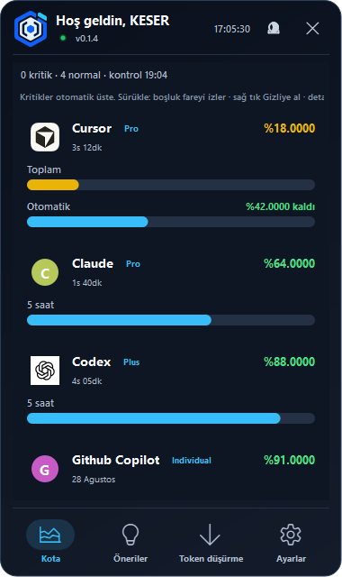
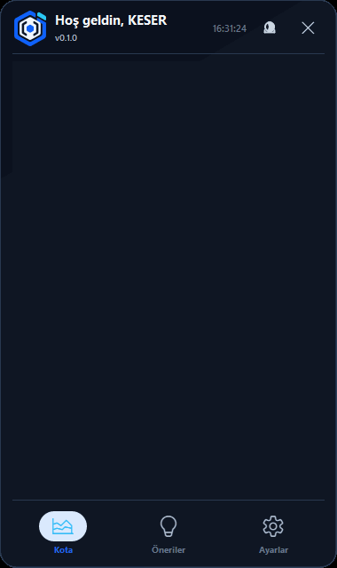
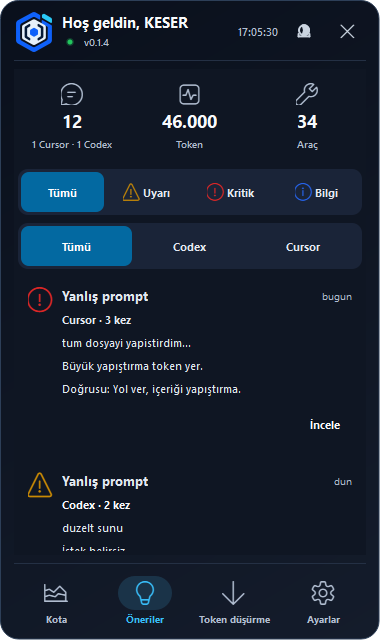
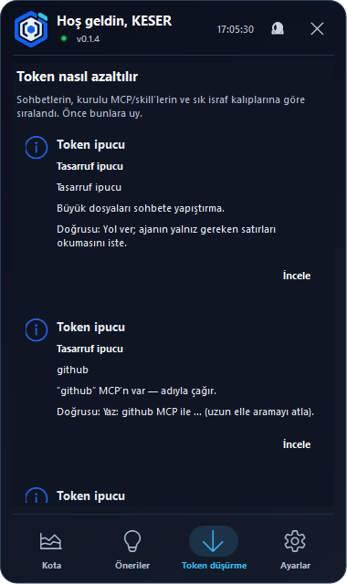
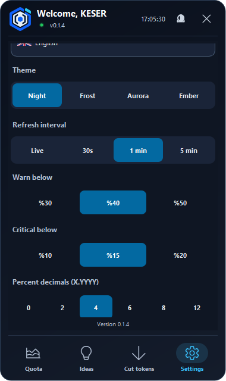

# Token Tracker

[](https://github.com/osmankesser/TokenTakip/releases)
[](LICENSE)
[](https://github.com/osmankesser/TokenTakip/releases)

---

## Türkçe

### Tüm yapay zekâ kullanım haklarınızı tek ekranda görün

**Token Tracker**, Cursor, Codex, Claude, Gemini ve GitHub Copilot hesaplarınızdaki **kalan kullanım hakkını** Windows masaüstünde gösteren **ücretsiz ve açık kaynaklı** bir uygulamadır.

Verilerinizi geliştiriciye göndermez. İlk açılışta **tek bir onay** ile lisansı kabul eder, kota erişimini ve sohbet analizini birlikte açarsınız — isterseniz sonra Ayarlar’dan kapatabilirsiniz.

<p align="center">
  
</p>

<p align="center">
  
</p>

### Nasıl çalışır?

1. **İndirin ve çalıştırın** — [Release](https://github.com/osmankesser/TokenTakip/releases/latest) ZIP’ini açın, klasörün tamamını koruyun, `TokenTracker.exe`’yi başlatın.
2. **Tek onay** — Lisans + kota + sohbet analizi birlikte sorulur. Kabul edince uygulama hazır; reddederseniz çıkar.
3. **Kota ekranı** — Bilgisayarınızdaki oturum dosyasını okur ve **ilgili hizmetin resmî API’sine** sorar. Kritik kartlar üstte, detay için karta tıklayın.

<p align="center">
  
</p>

### Hangi serviste ne gösterilir?

| Servis | Ne okunur | Ekranda ne görünür |
|--------|-----------|-------------------|
| **Cursor** | Yerel Cursor oturumu → `api2.cursor.sh` | Plan; **kalan %**; **dönem yenilenme zamanı** |
| **Codex** | Yerel Codex oturumu → `chatgpt.com` | Plan; **5 saat / günlük / haftalık** **kalan %** |
| **Claude** | Yerel `.claude` kimlik dosyası → Anthropic API | Plan; **5 saat** ve **haftalık** **kalan %** |
| **Gemini** | Yerel Gemini OAuth → Google API | Model başına **kalan %** |
| **GitHub Copilot** | Yerel GitHub oturumu (`gh`) → GitHub API | Plan; Premium / Chat / Tamamlama **kalan %** |

### Sistem gereksinimleri

| Platform | Destek |
|----------|--------|
| **Windows 10 / 11 (64-bit)** | Tam destek — hazır ZIP |
| **macOS 11+ (64-bit, Intel/Apple Silicon)** | Kaynak koddan çalıştırma / kendi derlemeniz |
| **Linux x86_64** | Kaynak koddan çalıştırma / kendi derlemeniz |
| **32-bit** | Desteklenmez (Qt 6 / Python 64-bit gerekir) |
| **Windows 7 / 8** | Desteklenmez (Qt 6 minimum Windows 10) |

Kota okuma yolları artık üç platformda da yerel Cursor/Codex/Claude klasörlerini arar. Başlangıçta otomatik açılma: Windows kayıt defteri, macOS LaunchAgents, Linux autostart.

### İndirme (Windows)

1. **[Releases](https://github.com/osmankesser/TokenTakip/releases/latest)** → `TokenTracker-0.1.4-win64.zip`
2. ZIP’i açın — **yalnız `.exe`’yi taşımayın** (`_internal` klasörü şart).
3. `TokenTracker.exe`’yi çalıştırın.

SHA-256: `release/TokenTracker-0.1.4-win64.sha256.txt` dosyasında.

### 0.1.4’te neler yeni?

- **Canlı yenileme** (5 sn) ve sürüm yanında durum noktası
- **Token düşürme** ipuçları ayrı sayfada
- Kartları **sürükle-bırak** ile sırala; sağ tık ile gizle
- Yüzde **ondalık basamak** seçimi (X.YYYY)
- Düşüş göstergesi `(-n)` ve tray’de en düşük kalan

<p align="center">
  
</p>

### “Bilinmeyen yayıncı” uyarısı neden çıkar?

Bu sürüm **dijital imzalı değildir**. Windows SmartScreen imzasız `.exe` dosyalarında uyarı gösterebilir — bu virüs demek değildir. Kaynak kodu açık; ZIP hash’i ile doğrulayın.

### Gizlilik (kısa)

| | |
|---|---|
| Geliştirici sunucusu | **Yok** — token/sohbet bize gitmez |
| Kota | Yerel oturum → yalnızca resmî API |
| Sohbet analizi | Bilinen yerel klasörler; internete gönderilmez |
| İzinler | Tek açılış onayı; sonra Ayarlar’dan kapatılabilir |

İletişim: **keseryazilim@gmail.com**

---

## English

### See all your AI usage limits in one place

**Token Tracker** is a free, open-source Windows desktop app that shows **how much usage you have left** on Cursor, Codex, Claude, Gemini, and GitHub Copilot.

Nothing is sent to the developer. **One startup prompt** accepts the license and enables quota + chat analysis together — you can turn them off later in Settings.

<p align="center">
  
</p>

### How it works

1. **Download & run** — Get the [latest release ZIP](https://github.com/osmankesser/TokenTakip/releases/latest), extract the **whole folder**, run `TokenTracker.exe`.
2. **One consent** — License, quota access, and chat analysis in a single dialog.
3. **Quota screen** — Reads your **local session**, asks only each provider’s **official API**. Critical cards float to the top.

### System requirements

| Platform | Support |
|----------|---------|
| **Windows 10 / 11 (64-bit)** | Full — pre-built ZIP |
| **macOS 11+ (64-bit)** | Run/build from source |
| **Linux x86_64** | Run/build from source |
| **32-bit** | Not supported |
| **Windows 7 / 8** | Not supported (Qt 6 needs Windows 10+) |

Quota paths work on Windows, macOS, and Linux. Startup registration uses the native mechanism on each OS.

### Download

Same ZIP as above. Verify with `TokenTracker-0.1.4-win64.sha256.txt`.

### Privacy

No telemetry. No developer server. Local session reads only; chat scan stays on your PC.

Contact: **keseryazilim@gmail.com**

---

### Build from source

```bat
cd /d "D:\token tracker"
python -m venv .venv
.venv\Scripts\pip install -r requirements-release.txt
.venv\Scripts\python.exe overlay.py
```

macOS / Linux: same `requirements-release.txt`, then `python overlay.py` (Python 3.12+ recommended).

Windows paket:

### License

App source: **MIT** (`LICENSE`). Qt / PySide6: **LGPL**.

Token Tracker is **not** affiliated with Cursor, OpenAI, Anthropic, Google, or GitHub.
