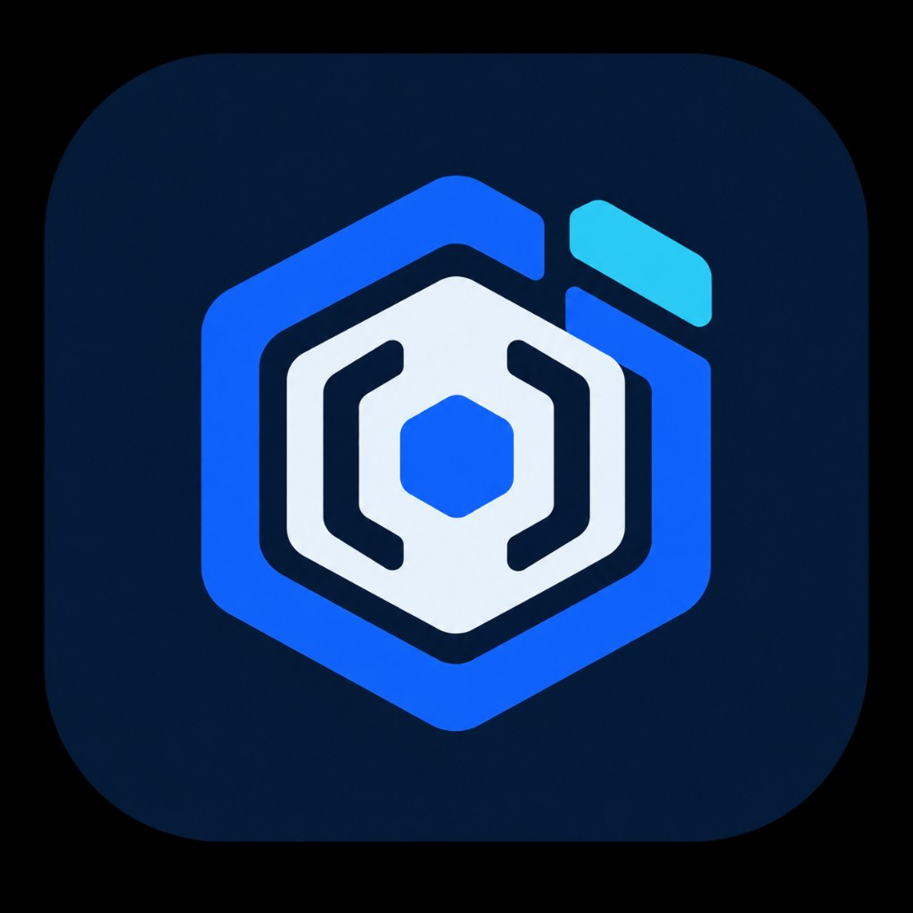
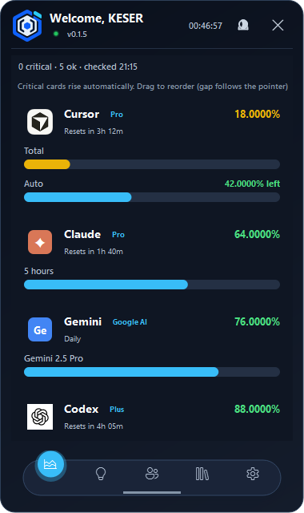
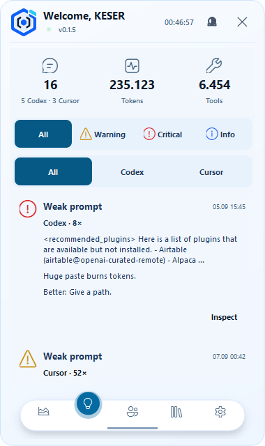
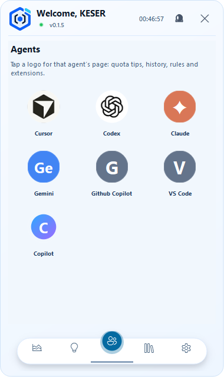
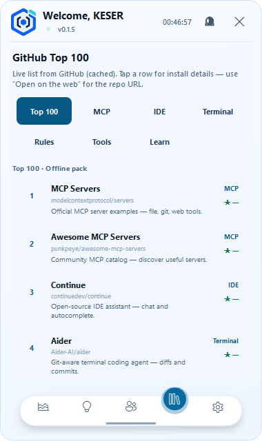
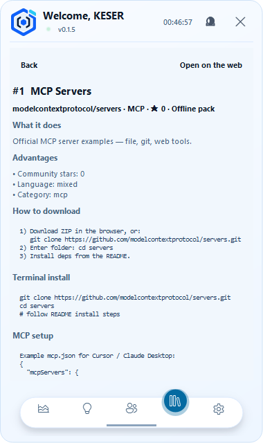
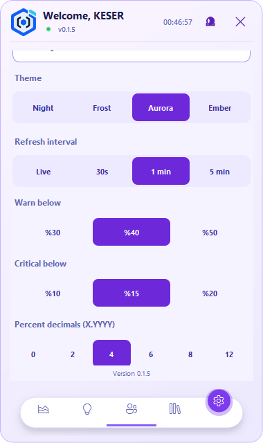

# Token Tracker

<p align="center">
  
</p>

<p align="center">
  <strong>Your AI quotas, agents, and practical usage insights — in one private desktop app.</strong>
</p>

<p align="center">
  <a href="https://github.com/osmankesser/TokenTakip/releases/latest"></a>
  <a href="https://github.com/osmankesser/TokenTakip/releases/latest"></a>
  
  <a href="LICENSE"></a>
</p>

<p align="center">
  <a href="https://github.com/osmankesser/TokenTakip/releases/latest"><strong>Download Token Tracker 0.1.5</strong></a>
  ·
  <a href="#privacy-first">Privacy</a>
  ·
  <a href="#build-from-source">Build from source</a>
</p>

---

<p align="center">
  
</p>

## One glance. Every AI limit.

Token Tracker is a free, open-source desktop companion for people who use multiple AI coding tools. It reads supported local sessions, asks only the relevant provider APIs, and presents the remaining quota in a compact always-available window.

Supported providers:

- **Cursor**
- **OpenAI Codex**
- **Anthropic Claude**
- **Google Gemini**
- **GitHub Copilot**

No account credentials are collected by the developer, no telemetry is sent to a developer server, and local chat analysis stays on your computer.

## What's new in 0.1.5

### A completely redesigned navigation experience

- Floating pill navigation inspired by modern mobile interfaces
- Theme-aware active colors and soft shadows
- Smooth, lightweight transitions without flicker
- Clear, consistently sized icons across all five sections

### New Agents workspace

- Automatically discovers supported AI agents installed or used on the computer
- Opens a dedicated profile for each agent
- Shows quota context, local history, rules, extensions, skills, and MCP integrations when available
- Places agent-specific usage advice directly inside the profile

### GitHub Top 100 inside the app

- Browse a curated/live list of useful agent, MCP, IDE, CLI, rules, tools, and learning projects
- Filter by category without leaving Token Tracker
- Open an in-app project page with benefits, download guidance, terminal commands, and MCP setup notes
- Uses a six-hour local cache and an offline catalog when GitHub is unavailable
- Opens a web browser only when **Open on the web** is explicitly selected

### Automatic GitHub description translation

- Public repository descriptions are translated into the selected interface language
- Translation runs in the background and is cached locally
- Terminal commands and code blocks are preserved
- If translation is unavailable, the original description remains visible

### More polish and localization

- Expanded interface translation coverage
- Improved quota cards, hover states, icon rendering, and page layouts
- Better theme consistency across Frost, Night, Aurora, and Ember
- Updated tests for navigation, agents, GitHub data, translation, and UI flows

## Screenshots

<table>
  <tr>
    <td align="center"><strong>Usage insights</strong><br></td>
    <td align="center"><strong>Detected agents</strong><br></td>
  </tr>
  <tr>
    <td align="center"><strong>GitHub Top 100</strong><br></td>
    <td align="center"><strong>Project details</strong><br></td>
  </tr>
  <tr>
    <td colspan="2" align="center"><strong>Aurora settings</strong><br></td>
  </tr>
</table>

## Core features

- Remaining quota percentages and reset times
- Critical quotas automatically placed first
- Drag-and-drop provider ordering
- Right-click provider hiding and easy restoration
- Configurable warning and critical thresholds
- Configurable percentage precision
- Live refresh mode and tray status
- Optional local chat analysis for practical token-saving recommendations
- Four visual themes and 21 interface languages
- Always-on-top mode and native startup registration
- Single-instance protection

## Download and install

### Windows 10 / 11 — recommended

1. Open the [latest release](https://github.com/osmankesser/TokenTakip/releases/latest).
2. Download **`TokenTracker-0.1.5-win64.zip`**.
3. Extract the entire archive.
4. Keep **`TokenTracker.exe`** and **`_internal`** in the same folder.
5. Run **`TokenTracker.exe`**.

> Do not move only the executable. The `_internal` directory contains the required runtime.

The release also includes a SHA-256 checksum file. Verify it in PowerShell:

```powershell
Get-FileHash .\TokenTracker-0.1.5-win64.zip -Algorithm SHA256
```

The app is currently unsigned. Windows SmartScreen may show an **Unknown publisher** warning; this is expected for an unsigned build. Verify the checksum and source before running it.

## How quota access works

- **Cursor:** local Cursor session → Cursor's official quota endpoint
- **Codex:** local Codex session → OpenAI's official usage endpoint
- **Claude:** local Claude credentials → Anthropic's official usage endpoint
- **Gemini:** local Gemini OAuth session → Google's official quota endpoint
- **GitHub Copilot:** local GitHub CLI session → GitHub's official Copilot endpoint

Token Tracker does not bypass provider limits. Availability depends on the local login state and the provider's current API behavior.

## Privacy first

- **No developer telemetry server**
- **No credentials uploaded to the developer**
- **No full-disk scanning**
- Quota access can be disabled from Settings
- Local chat analysis can be disabled independently
- Chat analysis scans only known local AI chat locations and does not upload chat content

When the interface language is not English, Token Tracker may send **public GitHub repository descriptions only** to Google Translate (`translate.googleapis.com`) for automatic translation. Results are cached in the local Token Tracker cache. Tokens, private chats, local files, and credentials are never sent for translation.

## System requirements

- Windows 10 or Windows 11, 64-bit
- Prebuilt release: Windows x64
- Source execution: Python 3.12+ recommended
- Qt 6 / PySide6

macOS and Linux paths/startup helpers exist in the source, but official prebuilt packages are not currently published for those platforms.

## Build from source

```powershell
git clone https://github.com/osmankesser/TokenTakip.git
cd TokenTakip
python -m venv .venv
.\.venv\Scripts\pip install -r requirements-release.txt
.\.venv\Scripts\python overlay.py
```

Run the main checks:

```powershell
.\.venv\Scripts\python -m unittest discover -p "test_*.py"
```

Build the Windows release:

```powershell
.\.venv\Scripts\python _build_deploy.py
```

The release ZIP and SHA-256 file are created under `release/`.

## License and disclaimer

Application source: [MIT License](LICENSE). PySide6/Qt components retain their respective licenses.

Token Tracker is an independent project and is not affiliated with, endorsed by, or sponsored by Cursor, OpenAI, Anthropic, Google, Microsoft, or GitHub. Product names and trademarks belong to their respective owners.

## Contact

**keseryazilim@gmail.com**
